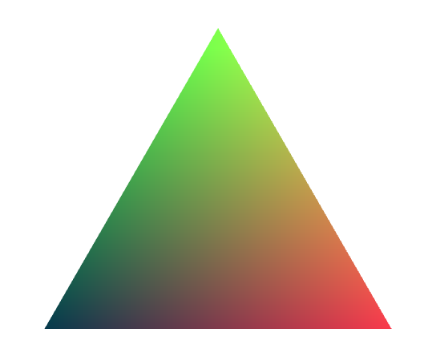

# limelight

[](https://github.com/drifting-in-space/limelight)
[](https://crates.io/crates/limelight)
[](https://docs.rs/limelight/)
[](https://github.com/drifting-in-space/limelight/actions/workflows/rust.yml)

Limelight is a `WebGL2` wrapper with a focus on making high-performance graphics code easier to
write and maintain.

In particular, it:
- Provides a functional interface that abstracts away the statefullness of WebGL.
  It accomplishes this by using a *shadow GPU* that tracks the GPU's state, diffs it with the
  desired state, and sends only the necessary instructions to WebGL.
- Provides abstractions for buffers and uniforms that defer GPU calls during the draw cycle.
  (See [WebGL Insights](http://www.webglinsights.com/) section 14.2, *Deferring until the Draw Cycle*.)
- Provides a typed interface to uniforms and buffers, and automatically generates vertex array objects
  (VAOs) from Rust data types through a derive macro.

## Getting started

See the [examples](https://github.com/drifting-in-space/limelight/tree/main/examples) directory for
full examples.

### Drawing a triangle

[](https://drifting-in-space.github.io/limelight/01-triangle/)

```rust
use web_sys::WebGl2RenderingContext;
use limelight::{Program, Renderer, DummyBuffer, DrawMode};

fn render_triangle(gl: WebGl2RenderingContext) {
  // limelight doesn't touch the DOM at all. Use your preferred
  // framework to create a canvas and create a WebGL2 context
  // from it.

  // Create a shader program by passing in GLSL code as strings for
  // the fragment and vertex shaders.
  let program = Program::new(
      include_str!("../../examples/01-triangle/shaders/shader.frag"),
      include_str!("../../examples/01-triangle/shaders/shader.vert"),
      DrawMode::Triangles
  ).gpu_init(&gl).unwrap();

  // Create a renderer. The renderer becomes the owner of the
  // WebGl2RenderingContext, to ensure that its internal representation
  // of the GPU state is always accureate.
  let renderer = Renderer::new(gl);

  // Run the program, rendering the results to the screen. We are
  // not passing any vertex attribute data, so we use a `DummyBuffer`
  // which renders three vertices: one for each corner of a triangle.
  renderer.render(&program, &DummyBuffer::new(3)).unwrap();
}
```

### Using buffers

[](https://drifting-in-space.github.io/limelight/02-buffer/)

```rust
use web_sys::WebGl2RenderingContext;
use limelight::{Program, Renderer, AttributeBuffer, DrawMode, BufferUsageHint, vertex_attribute};

// This attribute macro derives a number of traits, including `VertexAttribute`, which
// is required for a type to be used in an `AttributeBuffer`.
#[vertex_attribute]
struct VertexDescription {
    position: [f32; 2], // field names are mapped to variables in the shader.
}

impl VertexDescription {
    pub fn new(x: f32, y: f32) -> Self {
        VertexDescription { position: [x, y] }
    }
}

fn render_triangles(gl: WebGl2RenderingContext) {
  let program = Program::new(
      include_str!("../../examples/02-buffer/shaders/shader.frag"),
      include_str!("../../examples/02-buffer/shaders/shader.vert"),
      DrawMode::Triangles
  ).gpu_init(&gl).unwrap();

  let renderer = Renderer::new(gl);

  // Declare a buffer.
  let mut buffer: AttributeBuffer<VertexDescription> =
    AttributeBuffer::new(BufferUsageHint::DynamicDraw);

  buffer.set_data(vec![
    // Triangle #1.
    VertexDescription::new(-0.3, -0.3),
    VertexDescription::new(-0.5, -0.3),
    VertexDescription::new(-0.5, -0.5),

    // Triangle #2.
    VertexDescription::new(0.3, 0.3),
    VertexDescription::new(0.5, 0.3),
    VertexDescription::new(0.5, 0.5),
  ]);

  renderer.render(&program, &buffer).unwrap();
}
```

### TODO: uniforms, structuring animation
